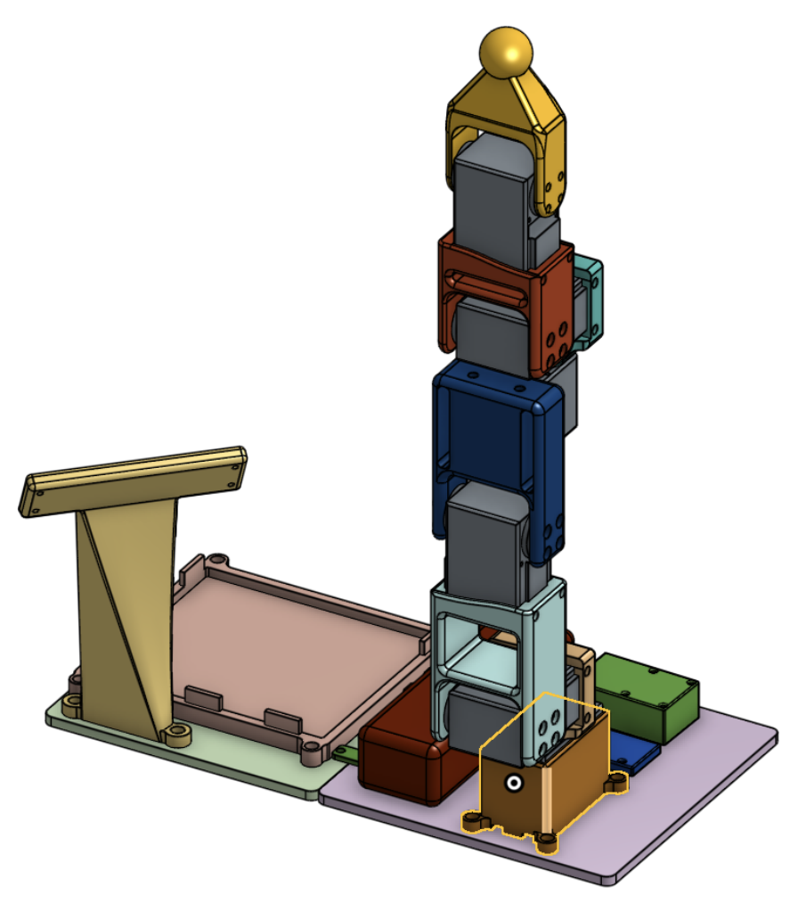
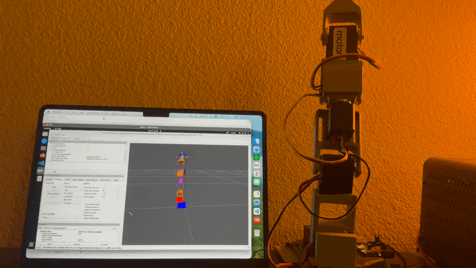

# Rotom
Rotom is a custom robot arm project that combines mechanical design, low-level servo control, and ROS 2 visualization/planning into one end-to-end robotics stack. The platform runs on a Jetson Orin Nano and supports remote ROS visualization from macOS.

  
  

---

## Demo

---∏
## Abstract
This repository contains the full development workflow: CAD-to-URDF modeling, servo-bus motor control in Python, ROS 2 launch and visualization, and cross-machine networking for remote RViz over WAN/VPN.

---
## System Architecture
Rotom is organized into three connected layers:

1. Robot description layer (`src/ros2_ws/src/rotom_description`):
- Mesh-based robot model (`urdf/rotom.urdf.xacro`) with RViz config and launch files.
- `robot_state_publisher` + `joint_state_publisher_gui` publish TF and joint states for visualization.

2. Motor control layer (`src/motors`, `src/examples`):
- Python motor bus utilities for Feetech smart servos.
- Includes setup, homing offset calibration, torque control, and ID management scripts.

1. Distributed ROS visualization layer (Redesigning through Pixi Environment Manager):
- Jetson runs robot nodes.
- macOS runs RViz (and planning tools).
- `zenoh-bridge-ros2dds` carries ROS traffic between machines while DDS stays localhost-only on each host.

---
## Hardware
- Compute: NVIDIA Jetson Orin Nano (robot host).
- Actuation: Feetech STS3215 smart servos on a daisy-chained serial bus.
- Feedback: servo register reads such as `Present_Position`, `Present_Velocity`, and `Present_Load` are used for closed-loop state awareness.
- Mechanics: custom CAD links exported to STL meshes and assembled into the robot description package.
- Development host: macOS machine used for remote RViz/MoveIt workflows.

Note: Computer vision hardware (for example, stereo USB cameras) is planned and documented in future-work direction, but not yet integrated in this repository.

---
## Software Stack
- ROS 2 Humble (`colcon` workspace, `rclpy`, launch tooling, RViz2).
- `rotom_description` package for URDF/Xacro, meshes, launch files, and RViz config.
- Python motor stack in `src/motors` (adapted and extended from Hugging Face LeRobot components).
- Feetech communication via `scservo_sdk`, including reliability patching for packet timeout behavior.
- Remote networking with `zenoh-bridge-ros2dds` over Tailscale for Jetson-to-macOS visualization.
- macOS ROS environment via RoboStack/micromamba.
- MoveIt2 integration for motion-planning demos (see project GIF and setup notes).

---
## Key Concepts
- CAD to ROS integration: custom meshes imported into Xacro/URDF and rendered in RViz.
- Kinematic chain definition: joint axes/origins and link transforms tuned for Rotom geometry.
- Bus-level actuator control: register read/write access for torque, position goals, limits, and calibration.
- Calibration workflow: homing offset and position limit utilities for repeatable joint behavior.
- Distributed ROS architecture: robust cross-machine communication using Zenoh instead of DDS multicast.
- Motion planning and visualization: ROS + MoveIt2 tooling for interactive planning and debugging.

---
## Challenges
- ROS over mixed networks (Jetson ARM + macOS): DDS discovery is fragile over WAN/VPN, so I constrained DDS to localhost and bridged with Zenoh as the only cross-machine transport.
- Remote visualization setup on macOS: shell/environment differences (`setup.zsh` vs `setup.bash`) and package overlays caused integration issues; standardized startup helpers solved repeatability.
- Motor API reliability and version drift: I updated and adapted motor-control code for my workflow, including timeout patching in the Feetech SDK path and compatibility with current Python environments.
- Custom geometry planning behavior: default kinematics/planning settings needed tuning for Rotom's link/joint layout to get stable visualization and useful trajectories.

---
## Future Work
- Add perception with onboard camera input and integrate a vision-conditioned task pipeline.
- Introduce VLA-style policy experiments using PyTorch.
- Expand simulation + learning with Mujoco Playground and reinforcement learning workflows.
- Add fuller ROS package split (`rotom_control`, `rotom_moveit`, `rotom_bringup`) for cleaner deployment.

---
## Additional Documentation
- [Creating a Custom ROS2 Package](docs/ros2_createpackage.md)
- [Installing ROS2 on Mac](docs/ros2_macROS2.md)
- [MoveIt2 Setup](docs/ros2_moveit.md)
- [Remote Visualization on macOS](docs/ros2_remoteVis.md)
- [Setting Up a ROS2 Workspace](docs/ros2_workspace.md)
- [Jetson Headless Screen Sharing to macOS](Nano_ScreenShare.md)

