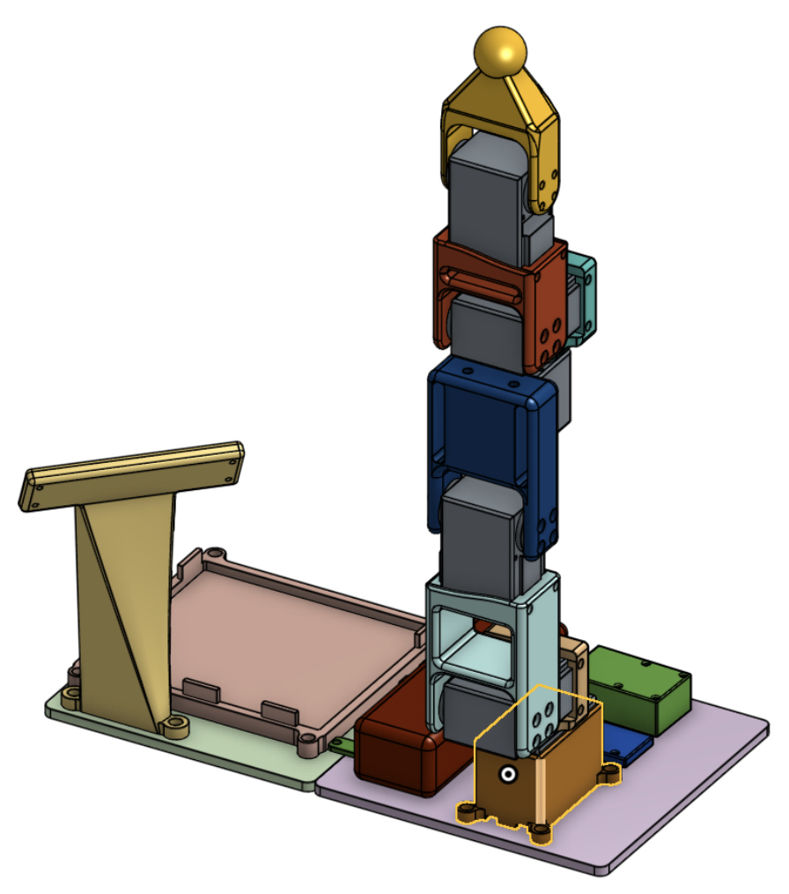

# Rotom
Rotom is a custom robot arm project that combines mechanical design, low-level Feetech servo control, ROS 2 bringup, and camera-guided end-effector servoing in one stack. The platform runs on a Jetson Orin Nano and includes remote RViz / MoveIt workflows from macOS.

<div style="display: flex; justify-content: space-between; padding: 0 40px;">
  
  
</div>

## Demo


## Current Focus
The current repository is no longer just a CAD + RViz project. As of March 16, 2026, it includes a working servo-control pipeline that can:

- read live joint state from the Feetech bus,
- detect ArUco markers from the stereo camera feed,
- turn marker error into end-effector motion commands,
- route those commands either through a custom Jacobian servo or through MoveIt Servo,
- and push the resulting joint targets onto the real robot.

## March 16, 2026 Progress
The main progress from March 16, 2026 was getting the servo-control path far enough along that it is worth documenting as a real subsystem instead of scattered experiments.

- `rotom_motor_bridge` now accepts both `JointState` commands and `JointTrajectory` output from MoveIt Servo on `/servo_node/joint_trajectory`.
- A new MoveIt Servo bringup path lives in `src/ros2_ws/src/rotom_moveit_config/launch/marker_follow_servo.launch.py`.
- The vision pipeline was tuned around the current camera and marker setup, including calibrated camera loading and 11 mm ArUco markers.
- `marker_follower_node.py` was upgraded to handle stale transforms, cached target reuse, and smoother Cartesian commands.
- A separate RViz drag-target path was added for controlled Cartesian servo testing without marker tracking.

## Repo Map
- `src/motors`: low-level Feetech bus helpers and register access.
- `src/examples`: one-off scripts for homing offsets, joint-limit export, calibration, and bus maintenance.
- `src/ros2_ws/src/rotom_control`: ROS 2 bridge between ROS topics/actions and the physical motor bus.
- `src/ros2_ws/src/rotom_vision`: camera split, ArUco tracking, marker following, and the custom Jacobian servo experiments.
- `src/ros2_ws/src/rotom_moveit_config`: MoveIt configuration plus the current MoveIt Servo marker-follow bringup.
- `src/ros2_ws/src/rotom_description`: the current Rotom URDF/Xacro, meshes, launch files, and RViz configs.

## What Carries Forward To The Next Robot
If the next robot keeps the same motors and camera but changes geometry, these parts are still the most reusable:

- the Feetech motor utilities in `src/motors`,
- the ROS motor bridge in `src/ros2_ws/src/rotom_control`,
- the camera split / calibration / ArUco tracking pipeline in `src/ros2_ws/src/rotom_vision`,
- the launch structure for dry-run vs live hardware bringup,
- and the Pixi tasks for repeatable build and launch commands.

## What Is Geometry-Specific
These files are tied closely to the current arm layout and will need to change when the next robot geometry is introduced:

- `src/ros2_ws/src/rotom_description/urdf/rotom.urdf.xacro`
- `src/ros2_ws/src/rotom_moveit_config/config/*`
- marker-to-end-effector offsets in `src/ros2_ws/src/rotom_vision/config/vision_pipeline.yaml`
- the hard-coded forward kinematics and Jacobian in `src/ros2_ws/src/rotom_vision/rotom_vision/visual_servo_node.py`

That last file is useful as a learning artifact, but it is the most specific to the old arm geometry. The MoveIt Servo path is the cleaner direction for the next robot.

## Main Bringup Paths
The most relevant commands in the current tree are:

```bash
pixi run ros2-build
pixi run ros2-marker-follow-moveit-dry
pixi run ros2-marker-follow-moveit-live
pixi run ros2-drag-servo-dry
```

## Hardware
- Compute: NVIDIA Jetson Orin Nano
- Actuation: Feetech STS3215 smart servos on a daisy-chained serial bus
- Vision: stereo USB camera, currently split into a selected eye for calibration and marker tracking
- Development host: macOS machine used for RViz / MoveIt workflows

## Software Stack
- ROS 2 Humble
- MoveIt 2 + MoveIt Servo
- Python motor stack in `src/motors`
- OpenCV ArUco / ChArUco tooling
- Pixi for repeatable workspace tasks
- Zenoh + Tailscale for remote ROS visualization across machines

## Additional Documentation
- [Creating a Custom ROS 2 Package](docs/ros2_createpackage.md)
- [Installing ROS 2 on Mac](docs/ros2_macROS2.md)
- [MoveIt 2 Setup](docs/ros2_moveit.md)
- [Remote Visualization on macOS](docs/ros2_remoteVis.md)
- [Setting Up a ROS 2 Workspace](docs/ros2_workspace.md)
- [Jetson Headless Screen Sharing to macOS](docs/Nano_ScreenShare.md)

