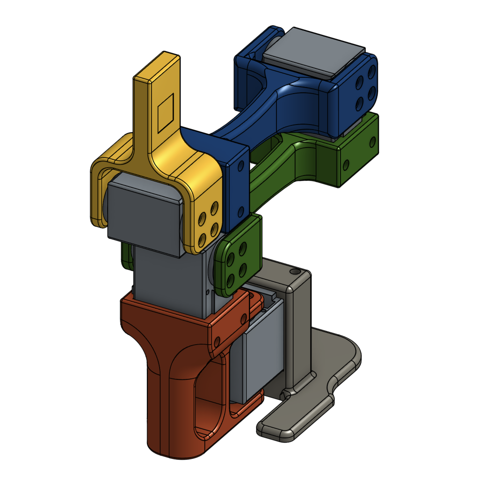
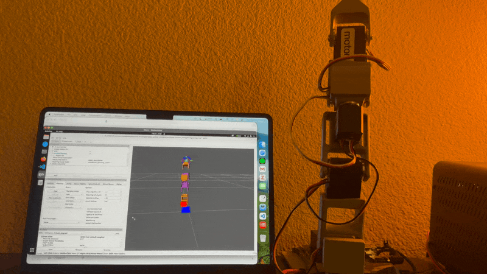
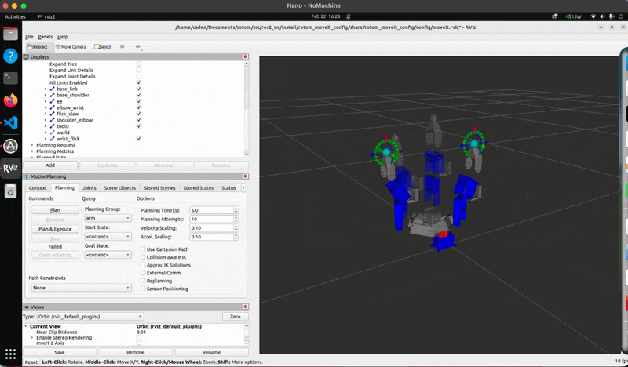

# Rotom
Rotom is a custom robot arm project that combines mechanical design, low-level Feetech servo control, ROS 2 bringup, perception, and real-time end-effector servoing on one stack. The platform runs on a Jetson Orin Nano and is now far beyond a CAD + RViz prototype: it can detect ArUco markers, convert pose error into Cartesian twist commands, route those commands through MoveIt Servo, and drive the real arm in closed loop.

<div style="display: flex; justify-content: center; gap: 20px;">
  
  
</div>

## Flagship Milestone: Real ArUco Marker Following
This is the most important result in the project as of recent. I now have reliable ArUco marker following on the real robot using a full perception-to-servo-to-hardware pipeline:

- stereo USB camera feed into ROS 2,
- selected-eye image split and calibration handling,
- ArUco pose estimation into TF,
- visual servo control that converts marker error into Cartesian twist,
- a twist relay interface into MoveIt Servo,
- and real joint motion on the physical robot.

This milestone matters because it proves three different subsystems at once:

- the vision control loop works on real data,
- the MoveIt Servo + twist relay interface works on real hardware,
- and the current mechanical design is stable enough to support closed-loop servo motion.

### Demo Gallery
<table>
  <tr>
    <td align="center" width="33%">
      <strong>1. Initial high-gain behavior</strong><br/>
      <br/>
      <sub>Fast, but oscillatory and choppy when marker tracking flickered.</sub>
    </td>
    <td align="center" width="33%">
      <strong>2. Retuned controller</strong><br/>
      <br/>
      <sub>Lower gains, lower caps and scaling</sub>
    </td>
    <td align="center" width="33%">
      <strong>3. Sufficient final behavior</strong><br/>
      <br/>
      <sub>More smoothing, and a timeout matched to a 10 fps camera stream. real-world marker-following subsystem.</sub>
    </td>
  </tr>
</table>

## Foundational Milestones That Made This Possible
The current ArUco-following result sits on top of several earlier milestones that were important in their own right. This project did not jump straight from CAD to marker following. It moved through a series of real hardware and software capabilities that each had to work first:

- low-level Feetech bus communication and safe motor bringup,
- joint-state readback and ROS 2 motor bridging on the real arm,
- MoveIt 2 integration and RViz-based motion validation,
- remote visualization and development from macOS into the Jetson-hosted stack,
- and camera calibration plus perception bringup before closed-loop control

These earlier milestones are still important because they are what made the current servoing result possible.

<table>
  <tr>
    <td align="center" width="33%">
      <strong>Interactive robot control</strong><br/>
      <br/>
      <sub>Early proof that the hardware and software stack could command the physical arm intentionally.</sub>
    </td>
    <td align="center" width="33%">
      <strong>MoveIt inverse kinematics</strong><br/>
      <br/>
      <sub>Proof that the robot description, planning setup, and kinematic model were usable.</sub>
    </td>
    <td align="center" width="33%">
      <strong>MoveIt motion execution</strong><br/>
      <br/>
      <sub>Proof that higher-level motion generation worked before the project moved into visual servoing.</sub>
    </td>
  </tr>
</table>

## How The Controller Works
The current live stack is:

`camera -> stereo_splitter -> aruco_tracker -> TF -> marker_follower -> /rotom_servo/cartesian_cmd -> twist_relay -> /servo_node/delta_twist_cmds -> MoveIt Servo -> /servo_node/joint_trajectory -> rotom_motor_bridge -> motors`

Main nodes and topics:

- `v4l2_camera_node`
  publishes `/image_raw` and `/camera_info`
- `stereo_splitter`
  subscribes to `/image_raw`, selects one eye (I am using a usb stereo camera that I hope to get depth from later), and republishes `/camera/selected/image_raw` and `/camera/selected/camera_info`
- `aruco_tracker`
  subscribes to `/camera/selected/image_raw` and `/camera/selected/camera_info`, estimates marker pose, and publishes TF frames such as `aruco_marker_1` and `aruco_marker_2`
- `marker_follower`
  reads the TF transform between the robot-mounted marker and the object marker, then publishes `geometry_msgs/Twist` on `/rotom_servo/cartesian_cmd`
- `twist_relay`
  converts that `Twist` into the `TwistStamped` command expected by MoveIt Servo on `/servo_node/delta_twist_cmds`
- `servo_node`
  uses the robot model and Jacobian-based servoing to turn Cartesian motion requests into `/servo_node/joint_trajectory`
- `rotom_motor_bridge`
  converts those joint trajectories into commands on the Feetech motor bus

## Math Behind The Visual Servo Loop
The control law is intentionally simple and inspectable.

The tracker gives a transform from the robot marker to the object marker:

- `T_robot_marker_to_object_marker`

I then define two fixed geometric offsets:

- `T_robot_marker_to_ee`
- `T_object_marker_to_ee_target`

Those offsets encode:

- where the end effector is relative to the robot marker
- where I want the end effector to be relative to the object marker (I chose about 2cm along x axis of EE)

The desired end-effector pose in the robot-marker frame is:

- `T_robot_marker_to_ee_desired = T_robot_marker_to_object_marker * T_object_marker_to_ee_target`

The current-to-desired end-effector error is then:

- `T_ee_to_ee_desired = inverse(T_robot_marker_to_ee) * T_robot_marker_to_ee_desired`

From that matrix:

- translation error becomes a 3D position error vector
- rotation error becomes a rotation vector

The follower maps those errors into a twist command:

- `v = clamp(k_linear * position_error, max_linear_speed)`
- `w = clamp(k_angular * rotation_error, max_angular_speed)`

That twist is published on `/rotom_servo/cartesian_cmd`.

The `twist_relay` then republishes the command on `/servo_node/delta_twist_cmds` in the frame expected by MoveIt Servo. MoveIt Servo uses the current robot state and Jacobian to solve for joint motion that best realizes that Cartesian twist while respecting joint limits and servo safety checks. That is what makes the whole pipeline a real servo-control system rather than just a perception demo.

## Why The Tuning Changed
The early ArUco-following demos were fast but not good. The robot oscillated, especially in rotation, and the motion felt choppy.

The main reasons were:

- gains and maximum speeds were too aggressive for the real hardware,
- the twist relay and follower were clamping at different levels,
- the camera was only running at 10 fps in the stable mode,
- and losing even a few frames caused the controller to alternately drop and reacquire target motion.

The fixes that materially improved behavior were:

- lowering gains and maximum twist caps,
- reducing rotational aggressiveness more than translational aggressiveness,
- adding command smoothing,
- aligning the follower and relay speed limits,
- and increasing the stale-transform timeout because the camera is only running at 10 fps

That last point was especially important. At 10 fps, a `0.25 s` stale timeout only allows around 2-3 missed frames before the target is treated as lost. Increasing that timeout made the controller much less stop-go when detections flickered.

## From The Legacy Version To This One
The current design solved two major failure modes from the legacy marker-following path.

### Legacy geometry problem
The old geometry and custom visual servo path would constantly report that the arm was near singularity, so the controller would effectively refuse to move or would stall in the exact moments where marker following was supposed to help.

### Legacy mechanical problem
The old physical motor layout was not stiff enough. The lower joints had oscillatory behavior caused by the hardware itself, not just bad gains. That meant individual PID tuning could not fully solve the motion quality problem because the mechanical structure was feeding instability into the loop.

### Current result
The current robot geometry and servo path eliminate both issues:

- the MoveIt Servo path is no longer constantly trapped by the same singularity behavior,
- the mechanical redesign is stable enough that the lower-joint oscillation is no longer the dominant issue,
- and the remaining problems were ordinary systems-integration problems that could be solved with launch design, DDS setup, perception tuning, and controller tuning

That makes this redesign a successful one.

## Major Challenges Overcome
- Fixed stale-TF behavior so the arm no longer keeps reusing an old marker pose after the markers disappear.
- Diagnosed camera dropouts and added recovery behavior when the raw image stream stalls.
- Reworked the ROS launch environment so the Jetson could run the full stack consistently without Pixi/OpenSSL/ROS conflicts.
- Diagnosed a DDS discovery failure that turned out to be a CycloneDDS participant limit issue.
- Fixed the DDS issue by moving to a clean ROS environment and raising CycloneDDS `MaxAutoParticipantIndex`, which was the reason the system would fail once the stack grew beyond roughly nine active participants.
- Split standalone debug viewers from the live control stack so visualization could run without starting duplicate camera/tracker pipelines.

## Skills Demonstrated In This Milestone
- Mechanical redesign for stability, not just appearance
- Embedded robot bringup on Jetson Linux
- Low-level smart-servo bus integration
- ROS 2 node/package design
- ROS 2 launch design and task automation with Pixi
- TF-based perception and frame-graph reasoning
- Camera calibration, ArUco tracking, and debug visualization
- Real-time Cartesian servo control
- MoveIt Servo integration on physical hardware
- Controller tuning across perception, middleware, and actuation layers
- DDS and middleware debugging
- End-to-end systems debugging across hardware, drivers, ROS, and control software

## What This Unlocks Next
This ArUco-following milestone is the proof I needed before moving on to teleoperation and learning.

Because the system now has:

- working servo control on the real robot,
- a working twist command interface,
- and a working vision control loop

I can now move forward to teleoperation as the next major subsystem. The current direction is:

- teleoperation driven by MediaPipe,
- collecting demonstrations on the real platform,
- and then using those demonstrations for learning-based control, initially with diffusion policies

The marker-following work was the prerequisite that made that next step realistic.

## Current Bringup Paths
The most relevant commands in the repository right now are:

```bash
just ros2-build
just ros2-reset
just ros2-servo-real-headless
just ros2-twist-relay
just ros2-vision-follow
just ros2-view-camera
just ros2-view-aruco
```

## Repo Map
- `src/motors`: low-level Feetech bus helpers and register access
- `src/examples`: one-off scripts for homing offsets, joint-limit export, calibration, and bus maintenance
- `src/ros2_ws/src/rotom_control`: ROS 2 bridge between ROS topics/actions and the physical motor bus
- `src/ros2_ws/src/rotom_vision`: camera split, ArUco tracking, marker following, debug viewers, and visual-servo logic
- `src/ros2_ws/src/rotom_servo`: the twist relay interface into MoveIt Servo
- `src/ros2_ws/src/rotom_moveit_config`: MoveIt configuration plus Servo bringup for the real robot
- `src/ros2_ws/src/rotom_description`: the current Rotom URDF/Xacro, meshes, launch files, and RViz configs
- `scripts`: ROS environment isolation, DDS configuration, and reset helpers used by the current bringup flow (hours of troubleshooting went into these scripts, so they are important to the current workflow)

## Hardware
- Compute: NVIDIA Jetson Orin Nano
- Actuation: Feetech STS3215 smart servos on a daisy-chained serial bus
- Vision: stereo USB camera, split into a selected eye for calibration and marker tracking
- Development host: macOS machine used for RViz / MoveIt workflows

## Software Stack
- ROS 2 Humble
- MoveIt 2 + MoveIt Servo
- Python motor stack in `src/motors`
- Repo-local `.venv` for non-ROS helper scripts, with system Python fallback
- OpenCV ArUco / ChArUco tooling
- Just for command shortcuts
- CycloneDDS for the current stable multi-node ROS graph
- Zenoh + Tailscale for remote ROS visualization across machines

## Additional Documentation
- [Creating a Custom ROS 2 Package](docs/ros2_createpackage.md)
- [Installing ROS 2 on Mac](docs/ros2_macROS2.md)
- [MoveIt 2 Setup](docs/ros2_moveit.md)
- [Remote Visualization on macOS](docs/ros2_remoteVis.md)
- [Setting Up a ROS 2 Workspace](docs/ros2_workspace.md)
- [Jetson Headless Screen Sharing to macOS](docs/Nano_ScreenShare.md)
